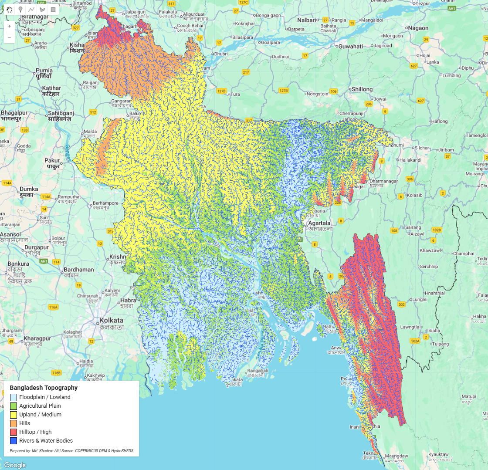

## Bangladesh Topography & Water Map  
This project visualizes the **topographical and hydrographic features of Bangladesh** using Google Earth Engine.  
It classifies the landscape based on elevation and highlights floodplains, agricultural plains, uplands, hills, hilltops, and major rivers or water bodies — creating a **comprehensive geomorphological map** of the country.

---

## Elevation-Based Landform Classification using Google Earth Engine (GEE)

  
*Figure: Elevation and water features of Bangladesh (Visualization by Khadem Ali)*

---

## Data Sources
| Dataset | Description | Provider |
|----------|--------------|----------|
| **COPERNICUS DEM (GLO-30)** | 30-meter Digital Elevation Model used for height-based classification. | *European Space Agency (ESA)* |
| **HydroSHEDS Free-Flowing Rivers** | Global river network for delineating water features. | *World Wildlife Fund (WWF)* |
| **USDOS/LSIB_SIMPLE (2017)** | Country boundary dataset. | *U.S. Department of State* |

---

## Methodology
1. **Study Area Selection** → Bangladesh boundary extracted from LSIB dataset.  
2. **DEM Processing** → COPERNICUS DEM mosaic and clipped to national boundary.  
3. **River Mapping** → HydroSHEDS rivers rasterized and merged with DEM-based low-lying zones.  
4. **Classification Rules**:  
   | Class | Description | Elevation Range (m) | Color |
   |--------|--------------|--------------------|--------|
   | 1 | Floodplain / Lowland | `< 5` | `#d0f0ff` |
   | 2 | Agricultural Plain | `5–10` | `#a0e060` |
   | 3 | Upland / Medium | `10–30` | `#ffff66` |
   | 4 | Hills | `30–60` | `#ffb366` |
   | 5 | Hilltop / High | `> 60` | `#ff6666` |
   | 6 | Rivers & Water Bodies | — | `#3366ff` |

5. **Visualization** → Layer styled with color palette and rendered on GEE Map.  
6. **Legend** → Custom UI panel added with labels, color boxes, and attribution.

---

## Code Snippet (Google Earth Engine)
```javascript
// See full GEE script in: code/bangladesh-topography.js
Map.addLayer(classified, {min:1,max:6,palette:palette}, 'Bangladesh Topography');

---

© mdkhademali